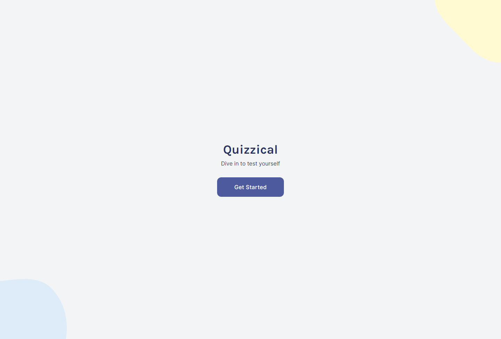
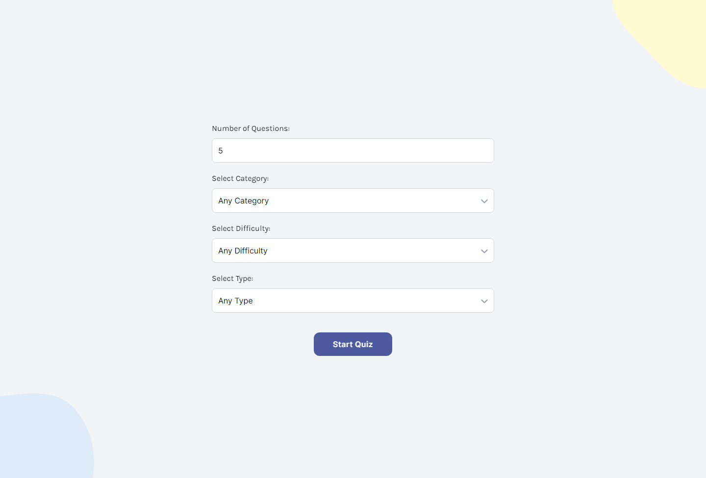
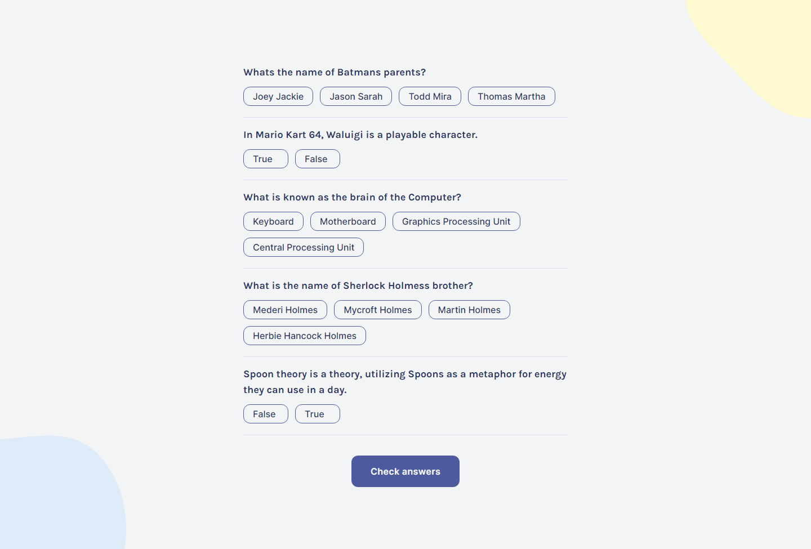
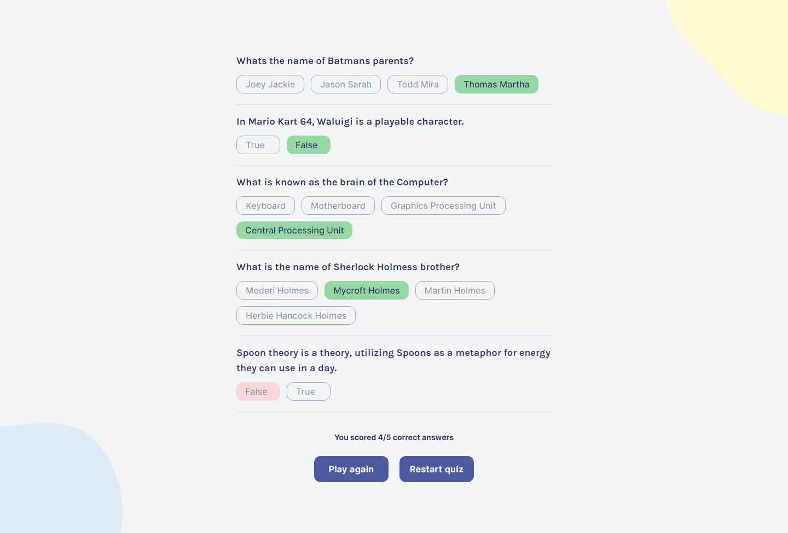

# Scrimba - Quizzical Trivia solution

This is a solution to the [Quizzical Trivia solo project on Scrimba](https://scrimba.com/learn/learnreact/react-section-4-solo-project-co24f49bea8aace7c174082c8). Scrimba helps you improve your coding skills by building realistic projects.

## Table of contents

- [Scrimba - Quizzical Trivia solution](#scrimba---quizzical-trivia-solution)
  - [Table of contents](#table-of-contents)
  - [Overview](#overview)
    - [The challenge](#the-challenge)
    - [Screenshot](#screenshot)
    - [Links](#links)
  - [My process](#my-process)
    - [Built with](#built-with)
  - [Author](#author)
  - [Credits](#credits)

## Overview

### The challenge

Users should be able to:

- Choose the kind of questions they want to answers
- Receive error message when when some questions do not have none of its answers selected
- Replay the quiz or restart the whole quiz to choose different options

### Screenshot

### Links

- Solution URL: [Quizzical Trivia](https://github.com/wuzgood98/quizzical-trivia)
- Live Site URL: [Quizzical Trivia](https://quizzical-trivia98.netlify.app/)

## My process

### Built with

- Semantic HTML5 markup
- CSS custom properties
- Flexbox
- Mobile-first workflow
- [React](https://reactjs.org/) - JS library
- [Tailwindcss](https://tailwindcss.com/) - For styles

## Author

- Twitter - [@wuz_goood](https://www.twitter.com/wuz_goood)

## Credits

- [OpenTBD](https://opentdb.com/api_config.php) - API
